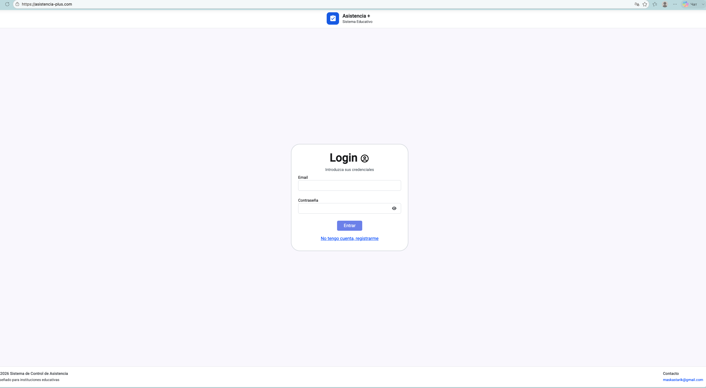
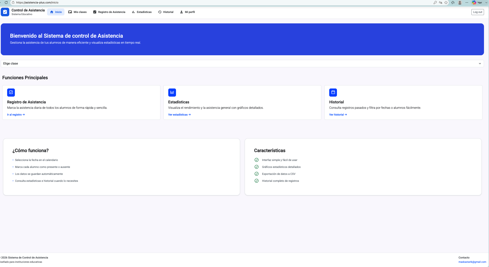
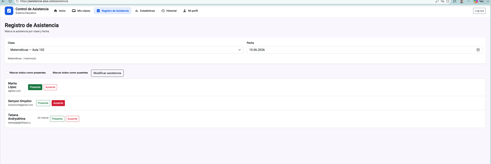
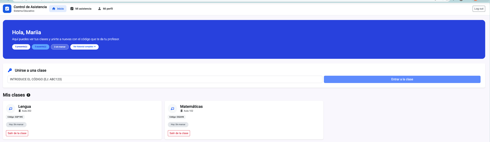
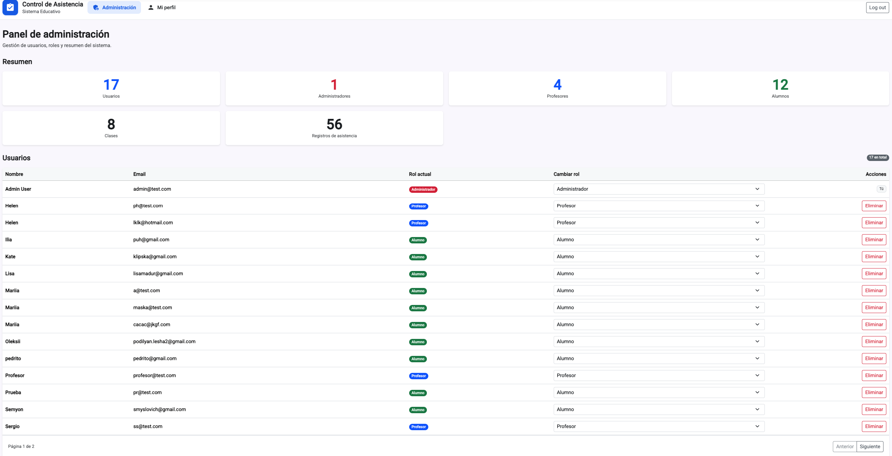

# Asistencia+ — Sistema de Control de Asistencia

Aplicación web full-stack para gestionar la asistencia en centros educativos. Permite a profesores registrar y consultar asistencia por clase, a alumnos ver su historial y unirse a clases con código, y a administradores gestionar usuarios y roles.

**Stack:** Laravel 12 (API REST) · Angular 21 (SPA) · JWT · MySQL · Bootstrap · Angular Material

---

## Portfolio

Proyecto pensado para demostrar desarrollo full-stack con autenticación, roles, API REST y SPA moderna.

| | |
|---|---|
| **Repositorio** | [github.com/Mariia-st/Control-de-asistencia](https://github.com/Mariia-st/Control-de-asistencia) |
| **Contacto** | maskastarik@gmail.com |

### Capturas de pantalla









### Qué demuestra este proyecto

- API REST con Laravel 12, migraciones, seeders y validación de peticiones
- SPA en Angular 21 con guards, interceptores HTTP y estado reactivo
- Autenticación JWT con refresh automático y control de acceso por roles (Spatie Permission)
- Tres perfiles de usuario (admin, profesor, alumno) con flujos distintos
- Exportación de historial a PDF y estadísticas visuales

---

## Características

### Profesor
- Panel de inicio con resumen de clases
- Crear, editar y eliminar clases (código único por clase)
- Gestionar alumnos
- Registro de asistencia diaria (presente / ausente)
- Estadísticas e historial por clase

### Alumno
- Unirse a clases con código del profesor
- Ver asistencia del día en cada clase
- Historial personal con KPIs y exportación a PDF
- Salir de una clase

### Administrador
- Panel de administración: resumen del sistema, usuarios y roles
- Cambiar rol de usuarios (admin / profesor / alumno)
- Eliminar usuarios
- Acceso a las pantallas de profesor (tiene todos los permisos)

### General
- Login y registro (alumno o profesor)
- Cambio de contraseña en perfil
- Autenticación JWT con refresh automático en el frontend
- Control de acceso por roles y permisos (Spatie Permission)

---

## Requisitos

| Herramienta | Versión |
|-------------|---------|
| PHP | 8.2+ |
| Composer | 2.x |
| Node.js | 20+ |
| npm | 10+ |
| MySQL / MariaDB | Recomendado en producción |
| SQLite | Válido para pruebas locales |

---

## Instalación rápida

### 1. Backend

```bash
cd Asistencia-back
cp .env.example .env
composer install
php artisan key:generate
php artisan jwt:secret
```

Configura la base de datos en `.env`:

```env
DB_CONNECTION=mysql
DB_HOST=127.0.0.1
DB_PORT=3306
DB_DATABASE=asistencia
DB_USERNAME=root
DB_PASSWORD=

APP_URL=http://127.0.0.1:8000
FRONTEND_URL=http://localhost:4200
```

Crea la base de datos y carga datos de demo:

```bash
php artisan migrate:fresh --seed
php artisan serve
```

API disponible en: `http://127.0.0.1:8000/api`

### 2. Frontend

```bash
cd Asistencia-front
npm install
npm start
```

App disponible en: `http://localhost:4200`

La URL del API se configura en:
- Desarrollo: `src/environments/environment.ts` → `http://127.0.0.1:8000/api`
- Producción: `src/environments/environment.prod.ts` → `/api` (mismo dominio)

---

## Usuarios de prueba

Tras ejecutar `migrate:fresh --seed`:

| Rol | Email | Contraseña |
|-----|-------|------------|
| Admin | admin@test.com | password |
| Profesor | ph@test.com | password |
| Alumno | a@test.com | password |

**DemoSeeder** crea además:
- 2 clases (Matemáticas, Lengua) del profesor Helen
- Alumno Mariia inscrita en ambas
- Registros de asistencia de los últimos 7 días

Para resetear todo y volver a los datos demo:

```bash
cd Asistencia-back
php artisan migrate:fresh --seed
```

Cierra sesión en el navegador después (el token anterior dejará de ser válido).

---

## Estructura del proyecto

```
Control-de-asistencia/
├── Asistencia-back/              # API Laravel
│   ├── app/
│   │   ├── Http/Controllers/     # Auth, Clase, Alumno, Asistencia, Admin…
│   │   └── Models/               # User, Clase, Alumno, Profesor, Asistencia
│   ├── database/
│   │   ├── migrations/
│   │   └── seeders/              # RoleSeeder, UserSeeder, DemoSeeder
│   ├── routes/api.php
│   └── config/                   # auth, jwt, cors…
│
├── Asistencia-front/             # SPA Angular
│   └── src/app/
│       ├── componentes/          # inicio, clases, administracion, alumno-inicio…
│       ├── servicios/            # api-service, auth-state
│       ├── interceptor-interceptor.ts
│       ├── auth-guard.ts
│       ├── permission.guard.ts
│       ├── role.guard.ts
│       └── app.routes.ts
│
└── docs/
    └── screenshots/              # Capturas para el README / portfolio
```

### Carpetas del frontend (`componentes/`)

| Carpeta | Descripción |
|---------|-------------|
| `inicio-sesion/` | Login y registro |
| `inicio/` | Panel del profesor |
| `redireccion-inicio/` | Redirección según rol al entrar |
| `clases/` | Gestión de clases y alumnos |
| `registrar-asistencia/` | Registro diario de asistencia |
| `estadisticas/` | Gráficos y resumen por clase |
| `historial/` | Historial con filtros y PDF |
| `alumno-inicio/` | Clases del alumno y unirse por código |
| `alumno-asistencia/` | Historial personal del alumno |
| `administracion/` | Panel de administración |
| `perfil/` | Datos de usuario y contraseña |
| `no-encontrado/` | Página 404 |
| `dialogo-error/` | Diálogo modal de errores |

---

## Rutas del frontend

| Ruta | Rol | Descripción |
|------|-----|-------------|
| `/` | Todos | Redirige al inicio según rol |
| `/inicio` | Profesor | Panel del profesor |
| `/admin` | Admin | Panel de administración |
| `/alumno/inicio` | Alumno | Clases del alumno + unirse por código |
| `/alumno/asistencia` | Alumno | Historial y PDF |
| `/clases` | Profesor / Admin | Gestión de clases |
| `/asistencia` | Profesor / Admin | Registro diario |
| `/estadísticas` | Profesor / Admin | Estadísticas por clase |
| `/historial` | Profesor / Admin | Historial de asistencia |
| `/perfil` | Todos | Datos y cambio de contraseña |

---

## API principal

### Públicas
| Método | Ruta | Descripción |
|--------|------|-------------|
| POST | `/api/login` | Iniciar sesión |
| POST | `/api/register` | Registro (alumno o profesor) |

### Autenticadas (`Authorization: Bearer <token>`)
| Grupo | Ejemplos |
|-------|----------|
| Sesión | `GET /me`, `POST /logout`, `POST /refresh`, `PUT /me/password` |
| Admin | `GET /admin/dashboard`, `GET /admin/usuarios`, `PUT /admin/usuarios/{id}/rol` |
| Alumno | `GET /alumno/clases`, `POST /alumno/unirse`, `GET /alumno/asistencia` |
| Profesor | `GET /profesor/clases`, `POST /clases`, `PUT /clases/{id}/asistencias` |

---

## Autenticación

1. El usuario hace login o registro → el backend devuelve un **JWT** (`access_token`).
2. Angular guarda el token en **`sessionStorage`** (una sesión por pestaña).
3. Un **interceptor HTTP** añade `Authorization: Bearer …` a cada petición.
4. Si el token expira (401), se intenta **`POST /api/refresh`** automáticamente.
5. El logout llama a **`POST /api/logout`** e invalida el token en el servidor.

---

## Roles y permisos

| Rol | Permisos |
|-----|----------|
| **admin** | Todos |
| **profesor** | Clases, alumnos, asistencia (listar y modificar) |
| **alumno** | Sin permisos Spatie de profesor; accede al panel alumno por rol |

Los permisos se gestionan con [Spatie Laravel Permission](https://spatie.be/docs/laravel-permission). Los roles se crean en `RoleSeeder`.

---

## Comandos útiles

```bash
# Backend — tests
cd Asistencia-back && php artisan test

# Backend — limpiar caché de config
php artisan config:clear && php artisan config:cache

# Frontend — build producción
cd Asistencia-front && npm run build
# Salida: dist/Proyecto/browser/
```

---

## Producción (resumen)

1. `APP_DEBUG=false` y contraseñas seguras en `.env`
2. `FRONTEND_URL` con la URL real (CORS en `config/cors.php`)
3. `npm run build` y servir `dist/Proyecto/browser/` con Nginx/Apache
4. API en `/api` o subdominio; en producción `environment.prod.ts` usa `apiUrl: '/api'`
5. Cambiar contraseñas de los usuarios demo antes de usar en entorno real

---

## Notas técnicas

- Al **eliminar una clase** o un **alumno**, sus registros de asistencia se borran en cascada (FK `onDelete cascade`).
- El **registro público** permite crear cuentas de alumno o profesor sin aprobación del admin.
- Tras un cambio de rol desde el panel admin, el perfil anterior (alumno/profesor) puede quedar en BD; conviene cerrar sesión y volver a entrar.

---

## Contacto

maskastarik@gmail.com

---

© 2026 Sistema de Control de Asistencia — Diseñado para instituciones educativas
